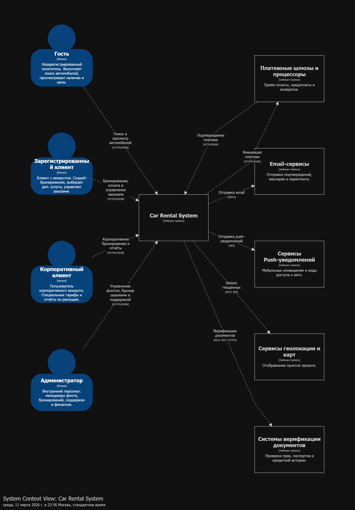
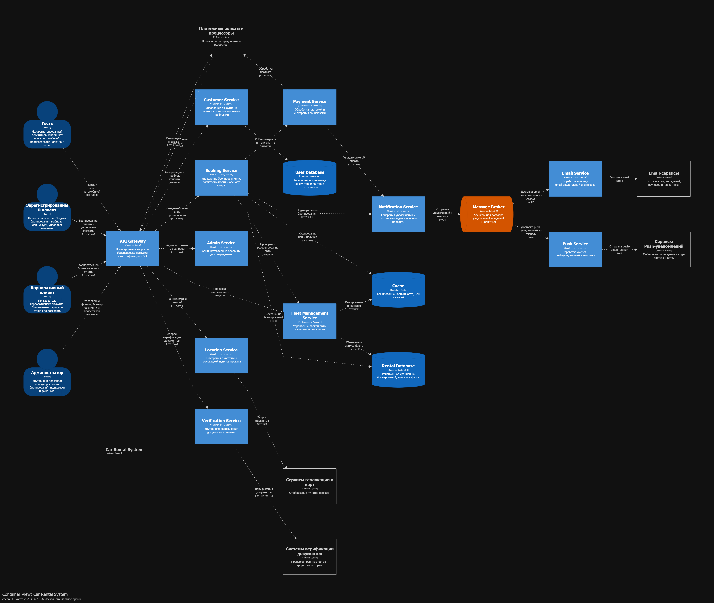
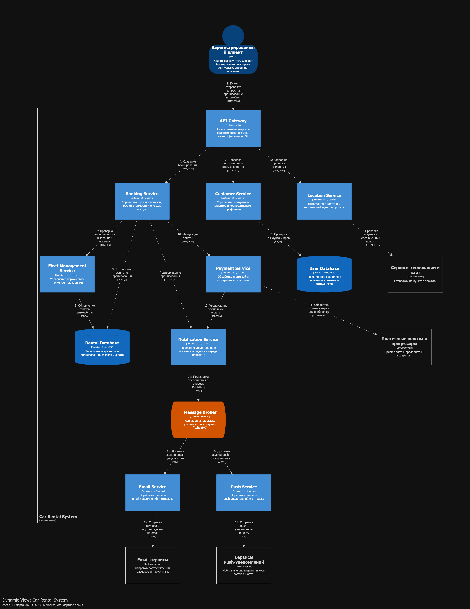

# Домашнее задание 01

## Документирование архитектуры в Structurizr

### Вариант №21 — Система управления арендой автомобилей

### Выполнил студент М8О-105СВ-25 Крючков Артемий Владимирович

---

# 1. Описание выбранного варианта

Разрабатывается система управления арендой автомобилей, позволяющая пользователям искать автомобили, бронировать их, оплачивать аренду и получать уведомления.

Система должна обеспечивать:

- поиск автомобилей по локации и дате;
- просмотр доступности и стоимости аренды;
- бронирование автомобиля;
- оплату аренды;
- управление бронированиями;
- отправку уведомлений пользователям;
- управление автопарком;
- проверку документов клиентов;
- поддержку корпоративных клиентов.

Система предназначена для использования как частными клиентами, так и корпоративными пользователями.

---

# 2. Роли пользователей и внешние системы

## Роли пользователей

### 1. Гость

Незарегистрированный пользователь системы.

Возможности:

- поиск автомобилей;
- просмотр доступных автомобилей;
- просмотр цен и условий аренды.

---

### 2. Зарегистрированный клиент

Пользователь, имеющий аккаунт в системе.

Возможности:

- бронирование автомобиля;
- выбор дополнительных услуг;
- оплата аренды;
- управление бронированиями;
- получение уведомлений.

---

### 3. Корпоративный клиент

Пользователь корпоративного аккаунта.

Особенности:

- специальные тарифы;
- централизованная оплата;
- отчеты по расходам;
- управление корпоративными бронированиями.

---

### 4. Администратор

Сотрудник компании аренды.

Функции:

- управление автопарком;
- управление бронированиями;
- обработка запросов поддержки;
- управление пользователями;
- просмотр отчетов.

---

## Внешние системы

### 1. Платежные шлюзы

Используются для:

- проведения платежей;
- обработки предоплат;
- возврата средств.

---

### 2. Email-сервисы

Используются для отправки:

- подтверждений бронирования;
- ваучеров;
- уведомлений;
- маркетинговых сообщений.

---

### 3. Сервисы Push-уведомлений

Используются для:

- отправки уведомлений в мобильные приложения;
- информирования о статусе бронирования;
- передачи кодов доступа к автомобилю.

---

### 4. Сервисы геолокации и карт

Используются для:

- отображения пунктов проката;
- определения геолокации;

---

### 5. Системы верификации документов

Используются для:

- проверки водительских прав;
- проверки паспортных данных;
- проверки кредитной истории клиента.

---

# 3. Диаграмма System Context (C1)

На уровне System Context система управления арендой автомобилей рассматривается как единый сервис, взаимодействующий с пользователями и внешними системами.

Взаимодействия:

Пользователи взаимодействуют с системой через API Gateway.

- Гость выполняет поиск автомобилей.
- Зарегистрированный клиент бронирует и оплачивает аренду.
- Корпоративный клиент оформляет корпоративные бронирования.
- Администратор управляет системой.

Система интегрируется со следующими внешними сервисами:

- платежные шлюзы для проведения оплаты;
- email-сервисы для отправки писем;
- push-сервисы для мобильных уведомлений;
- сервисы карт для геолокации;
- системы проверки документов.

Система выступает центральной платформой управления арендой автомобилей.

---

# 4. Основные Use Cases

## Для гостей

- поиск автомобилей;
- просмотр доступности автомобилей;
- просмотр цен.

---

## Для зарегистрированных клиентов

- регистрация и авторизация;
- поиск автомобиля;
- бронирование автомобиля;
- выбор дополнительных услуг;
- оплата аренды;
- управление бронированиями;
- получение уведомлений.

---

## Для корпоративных клиентов

- создание корпоративных бронирований;
- управление корпоративными заказами;
- получение отчетов по расходам.

---

## Для администратора

- управление автопарком;
- добавление и удаление автомобилей;
- изменение статуса автомобилей;
- управление бронированиями;
- управление пользователями;
- просмотр аналитики и отчетов.

---

# 5. Контейнерная архитектура (C2)

Система реализована с использованием микросервисной архитектуры, где каждый контейнер выполняет отдельную функцию.

---

# Инфраструктурный слой

### API Gateway (Nginx)

Основные функции:

- SSL termination;
- балансировка нагрузки;
- маршрутизация запросов;
- аутентификация пользователей.

---

# Основные сервисы

### Booking Service

Отвечает за:

- создание и изменение бронирований;
- расчет стоимости аренды;
- поддержку аренды в разных городах (one-way аренда).

---

### Fleet Management Service

Отвечает за:

- управление автопарком;
- контроль доступности автомобилей;
- управление локациями автомобилей.

---

### Customer Service

Отвечает за:

- управление аккаунтами пользователей;
- управление корпоративными профилями.

---

### Payment Service

Отвечает за:

- обработку платежей;
- интеграцию с платежными шлюзами.

---

### Notification Service

Функции:

- формирование уведомлений;
- отправка сообщений в очередь.

---

### Email Service

Функции:

- получение задач из очереди;
- отправка email-уведомлений.

---

### Push Service

Функции:

- отправка push-уведомлений пользователям.

---

### Admin Service

Используется сотрудниками компании для:

- управления системой;
- выполнения административных операций.

---

### Location Service

Отвечает за:

- работу с геоданными;
- интеграцию с сервисами карт.

---

### Verification Service

Отвечает за:

- проверку документов пользователей.

---

# Хранилища данных

### Rental Database (PostgreSQL)

Хранит:

- бронирования;
- заказы;
- информацию о транспортных средствах.

---

### User Database (PostgreSQL)

Хранит:

- данные пользователей;
- корпоративные аккаунты;
- данные сотрудников.

---

# Кэширование

### Cache (Redis)

Используется для:

- кэширования доступности автомобилей;
- кэширования цен;
- хранения сессий пользователей.

---

# Брокер сообщений

### Message Broker (RabbitMQ)

Используется для:

- асинхронной доставки уведомлений;
- обработки задач отправки сообщений.

---

# 6. Взаимодействие контейнеров

## Синхронные взаимодействия

Основные взаимодействия происходят через HTTP/JSON API.

Примеры:

- Gateway → Customer Service (авторизация)
- Gateway → Booking Service (создание бронирования)
- Gateway → Fleet Service (проверка доступности автомобиля)
- Booking Service → Payment Service (инициация платежа)
- Payment Service → Payment Gateway (обработка платежа)
- Location Service → Maps Services (получение геоданных)
- Verification Service → Verification Systems (проверка документов)

---

## Асинхронные взаимодействия

Для отправки уведомлений используется RabbitMQ.

Пример взаимодействия:

1. Booking Service создаёт событие бронирования.
2. Notification Service формирует уведомление.
3. Сообщение помещается в очередь RabbitMQ.
4. Email Service и Push Service получают сообщение из очереди.
5. Отправляются email и push-уведомления пользователю.

---

# 7. Dynamic диаграмма (архитектурно значимый сценарий)

## Сценарий: Бронирование автомобиля

Последовательность работы системы:

1. Клиент отправляет запрос на бронирование через API Gateway.
2. Gateway проверяет авторизацию через Customer Service.
3. Customer Service проверяет данные пользователя в User Database.
4. Gateway передает запрос в Booking Service.
5. Booking Service запрашивает геоданные через Location Service.
6. Location Service получает данные через внешний сервис карт.
7. Booking Service проверяет доступность автомобиля через Fleet Service.
8. Fleet Service обновляет статус автомобиля в Rental Database.
9. Booking Service сохраняет информацию о бронировании.
10. Booking Service инициирует оплату через Payment Service.
11. Payment Service выполняет платеж через внешний платежный шлюз.
12. После успешной оплаты формируется уведомление.
13. Notification Service отправляет сообщение в RabbitMQ.
14. Email Service получает задачу из очереди и отправляет письмо.
15. Push Service отправляет push-уведомление пользователю.

---

# 8. Выбор технологий

| Компонент        | Технология    |
| ---------------- | ------------- |
| API Gateway      | Nginx         |
| Backend сервисы  | C++ / Userver |
| Базы данных      | PostgreSQL    |
| Кэш              | Redis         |
| Брокер сообщений | RabbitMQ      |
| Email            | SMTP          |
| API              | HTTPS / JSON  |

---

# 9. Результат работы в картинках

